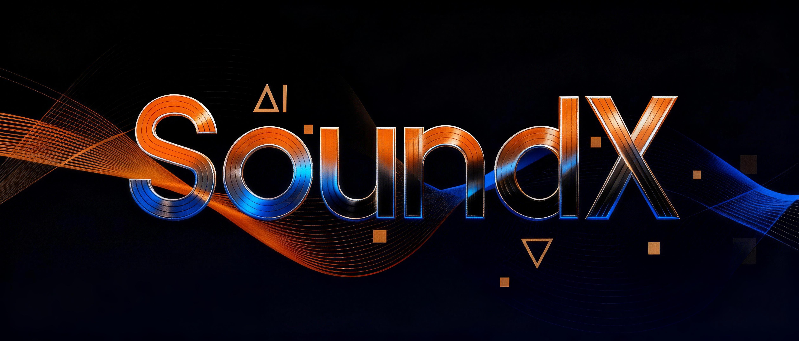

<div align="center">




<h1 align="center">SoundX</h1>
<p align="center">
  <strong>AI 原生数字音频工作站</strong><br/>
  <sub>面向音乐制作的自主智能体框架 —— 以自然语言驱动规划、生成与跨引擎交付。</sub>
</p>


#### [English](./README.md) | [中文文档](./README_CN.md)

</div>


## 目录

- [概述](#概述)
- [核心能力](#核心能力)
- [快速开始](#快速开始)

## 概述

SoundX 是一个全栈 AI 原生数字音频工作站，以自主智能体循环取代传统 DAW 的拖拽式工作流。用户以自然语言表达制作意图；系统负责意图分解、多步规划、工具编排、沙箱化代码生成与迭代优化，并面向包括 Web Audio、Native、Unreal Engine 和 Unity 在内的多种音频引擎。

## 核心能力

### 自然语言音乐制作

用简洁的语言表达你的创作愿景 —— "制作一首带有黑胶唱片杂音的 lo-fi hip hop" 或 "为人声添加温暖的模拟混响"。系统理解音乐意图并将其转化为可执行的工作流，消除了繁琐的参数调节。

### 多模态音频生成

无缝集成文本到音乐、文本到音效和人声生成模型。直接从描述性提示生成原创作品、逼真的乐器采样或声音设计元素，完全控制风格、情绪和技术参数。

### 智能混音与母带处理

AI 驱动的混音功能可根据流派惯例和艺术意图自动平衡音轨、应用均衡器、压缩和空间效果。智能母带处理通过自适应动态处理、立体声声像和响度标准化提供工作室级的结果，达到行业标准。

### 智能项目管理

智能组织音轨、分轨和素材。自动版本控制、分轨导出和协作功能。跨项目历史的语义搜索让你可以用自然语言回忆"上周我们尝试的那段贝斯旋律"。

### 个性化风格建模

系统通过持续交互学习你独特的制作风格。随着时间推移，它会推荐符合你艺术偏好的混音技术、声音设计选择和编曲决策，创造一个个性化的制作助手。

## 快速开始

### 环境要求

- **Python** ≥ 3.9
- **Node.js** ≥ 18
- **LLM API 密钥** — OpenAI、Anthropic 或兼容服务商

### 安装

```bash
git clone https://github.com/Yuan-ManX/SoundX.git
cd SoundX

pip install -r requirements.txt
cd web && npm install && cd ..

cp .env.example .env
# 配置 SOUNDX_LLM_API_KEY、SOUNDX_LLM_MODEL 等

./start-soundx.sh
```

## 开源协议

本项目基于 MIT 协议开源 —— 详见 [LICENSE](LICENSE)。

